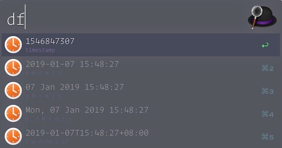
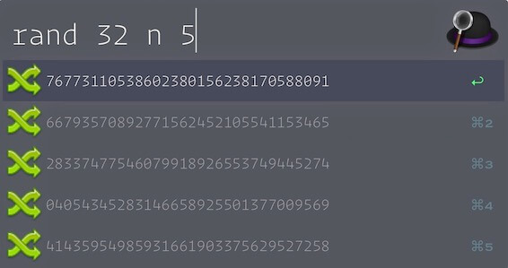

# alfred-workflows

### [DateTime Format](./alfred-datetime-format) `php` (df [$custom_format])

日期的各种格式，用php的DateTime实现，具体看 [DateTime::format](https://secure.php.net/manual/en/datetime.format.php)，`enter`复制，默认选项列表：

- timestamp
- `Y-m-d H:i:s`
- `d M Y H:i:s`
- `D, d M Y H:i:s`
- `Y-m-d\TH:i:sP`

### [Random String](./alfred-random-string) `php` (rand $lenght [$char] [$count])

生成随机字符串，默认有 `0-9a-zA-Z`，也可以定义随机字符

- `$length` - 长度
- `$char` - 随机字符 n: 0-9, l: a-z, u: A-Z, 或者输入4个字符或以上
- `$count` - 选项数量

